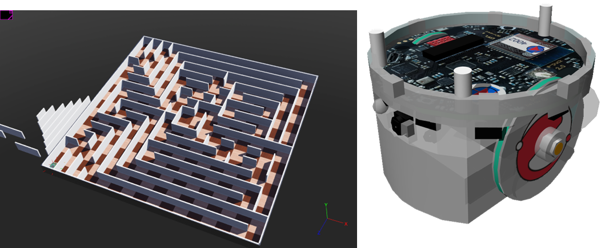
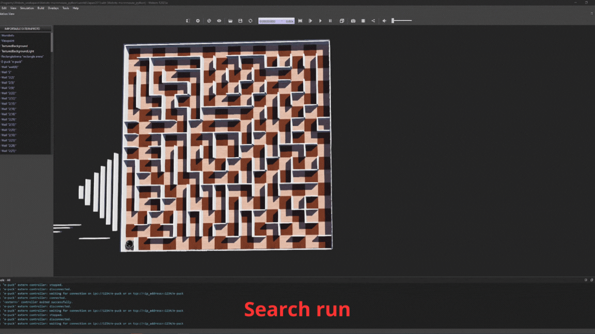
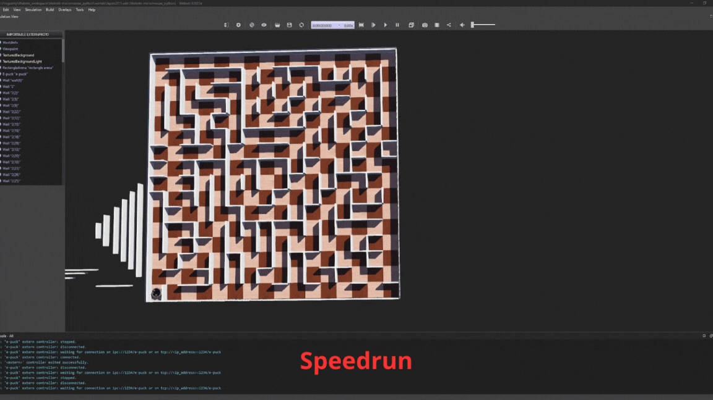
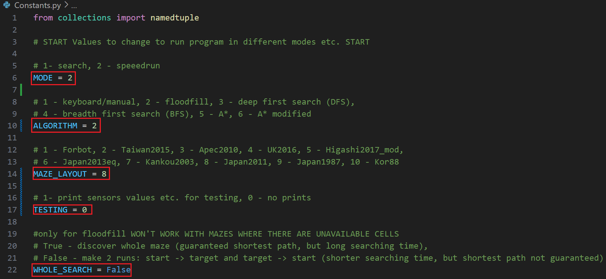

# Webots maze solver AKA MicroMouse

This project was created as a part of diploma thesis, which goal was to compare a few path planning algorithms with a use of mobile robot in simulated environment. Principle of operation of the program is based on MicroMouse competition, so it can serve as a platform/base for testing other control algorithms for MicroMouse or to learn about those already implemented.

## How to run

Before anything download and install Webots simulator in version R2023a (newer versions also should work) and Python3 on your PC. Optionally use VS Code editor.
1. Configure Webots
  
    a) Without VS Code / any external code editor 
    1. Open one of the worlds .wbt file from the project.
    2. Change controller of e-puck robot in Webots project from extern to *Maze_solver_py*. For each world this operation must be done sepearately. **Webots controller module won’t be recognised and syntax suggestions won’t work in external editor.** 
    
    b) With VS Code (preferred)
    1. Open a Webots/lib/controller folder in VS Code and create *setup.py* file (you may need to run VS code as admin).
    2. Paste a following code into file:
    ```python
    from setuptools import setup

    setup(name='webots', version='1.0', packages=['controller', 'vehicle'])
    ```
    3. Run in terminal command *python setup.py sdist* . It will create a source distribution for python package in dist folder.
    4. Run *pip install webots --no-index --find-links "file://C:\\path\\to\\dist"*. If there is an error about wrong version of *setuptools*, omit *--no-index* flag in command to allow pip to search for package outside of local directory.
    5. Go back to the project. A controller module now should be recognised by editor.
2. Add Results folder in *Maze_solver_py* directory with appropriate subfolders for each maze – They are not copied with repo. For example, if you want to use **Forbot** maze (listed in *Constants.py*) you need to create a *Forbot* directory in *Results* folder. Otherwise a ‘no such file or directory’ error will occur.
3. Open terminal in Maze_solver_py directory. Go to Webots simulation and run it, then run *main.py*. A simulation should execute and a window with maze drawing should pop up.
4. During a searching or speedrun information about the process is logged in terminal. After completing a course, the *run time* is printed and prompt to *press any key to end the program* appears.

## Features

- Simulation made in Webots application which contains 10 worlds with 10 mazes which were used in MicroMouse competitions in a past.
All mazes have start field in left down corner and goal fields in centre. Horizontal dimension of one field is 120 x 120 mm (not 180 x 180 which is a standard MicroMouse). That's because mobile robot Epuck2 was used and its IR distance sensors don't have enough range of operation.
- Robot controller is written in Python and implements following algorithms: Floodfill, BFS (Breadth first search), DFS (Deep first search), A*. 
From the level of program code we choose, which algorithm, maze layout and operation mode to use in next run.
- Visualisation of algorithm operation progress by drawing a searched maze and values related to algorithms operation.





## Used Python modules

- Controller – provided from Webots. Contains all classes and functions needed to control robot in the simulator.
- Collections – contains data structures which extend or are the alternative for the ones built in the Python - used i.a. to implement queue.
- Pickle – allows to data serialization to  e.g. save Python data structures, like dictionaries, to files.
- Turtle – contains classes and functions used to draw basic graphics - used to draw maze and algorithm progress during the program operation.
- Threading – allows to handle multi-threading in a program. Used to synchronize robot controller operation with a visualisation creation process and to not extend main loop execution time due to graphics drawing time.
## Code structure
Controller code responsible for robot control was divided in files based on the functionality to ease the navigation across the whole program.
- File **Constants.py** - contains variables, which values are constant during the program operation. These are mainly  data structures responsible for code readability. Because the program doesn't have any interface added, from the level of this file variables responsible for choose of opertion mode, algorithm and maze layout are set:
  - **MODE** - choose search run (maze exploration, path determination) or speedrun (drive straight to the goal by determined path)
  - **ALGORITHM** - choose algorithm used to search maze and determine path.
  - **MAZE_LAYOUT** - choose maze layout which is actually used in order to save drives results in adequate files.
  - **TESTING** - print in console values read by sensors (testing).
  - **WHOLE_SEARCH** -choose to search whole maze (only Floodfill algorithm). Unrecommended to use.

- Files **main.py** and **main_functions.py** - **main.py** is responsible to start chosen algorithm subprogram, which main loop is put into **main_functions.py** file.
- File **algorithm_functions.py** - contains functions responsible for robot actions logic, like change of move direction, orientation, algorithm subfunction execution etc.
- File **move_functions.py** - contains functions related to robot movement which are responsible for direct usage of robot peripherials like wheels turning, reading encoders values, position correction etc.
- File **map_functions.py** - contains functions related with maze map creation, like walls detection and map update.
- File **draw_maze.py** - contains functions responsible for robot operation visualisation. During simulation running while maze searching, currently explored maze layout is drawn in separate window. It is filled in with detected walls. Visited cells are marked with red dots. Additionally for Floodfill and A* algorithms, values assigned to individual fields, which are related to theirs operation, are written in each field. In speedrun, based on search run results, discovered maze layout is drawn with a path used to drive to the goal marked as red line as the robot progress.
- File **var.py** - global variables used for synchronization between main loop and visualisation.
- File **mazes_layouts.py** - contains text version of used mazes and lists with hex values representation.
## Implemented algorithms

- Floodfill - 2 approaches are available:
    1. Without searching whole maze - every cycle robot calculates shortest path to target and tries to go to it. When target is found it checks if it was the shrotest path by comparing paths for 2 mazes: actually discovered and discovered but cells which weren't visited are assumed with 4 walls. If path from actually discovered maze has same length as 2nd one - the shortest path was founded. If not robot makes second run - from target to start cell to search some of unvisited part of maze. Process reapeat's until shortest path is found.
    2. With searching whole maze - WORKS only for mazes, where ALL cells are accessible. Unrecommended to use.
- Deep first search DFS - Doesn't guarantee the shortest path but usually finds path very fast (micromouse mazes).
- Breadth first search BFS modified - It was adjusted for robot movement. BFS is a horizontal searching through graph by going by each 'level' of nodes. To avoid unnnecesary back-tracking, only forks are treated as 'levels', which means that robot will go back only when it moves to new fork or dead-end. Because of that it doesn't guarantees shortest path as the unmodified verions does.
- A* - Guarantees shortest path, but very long search time.
- A* modified - Modification (similar to BFS) is that robot chooses where to go in 2 ways:
    1. If current position is fork or dead-end - choose cell with lowest Fcost and/or Hcost (just like in normal A*).
    2. If current cell is corridor - keep going until it's fork or dead-end.This approach makes searching much faster than normal A*, because robot doesn't need to keep moving across whole maze to just check one cell. The only drawback is that this approach might not guarantee the shortest path, although in micromouse mazes it usually should find it.
## Software version

Software versions used in the project:
- Webots R2023a
- Python 3.11.3
  - pip 22.3.1
## License

Apache-2.0

